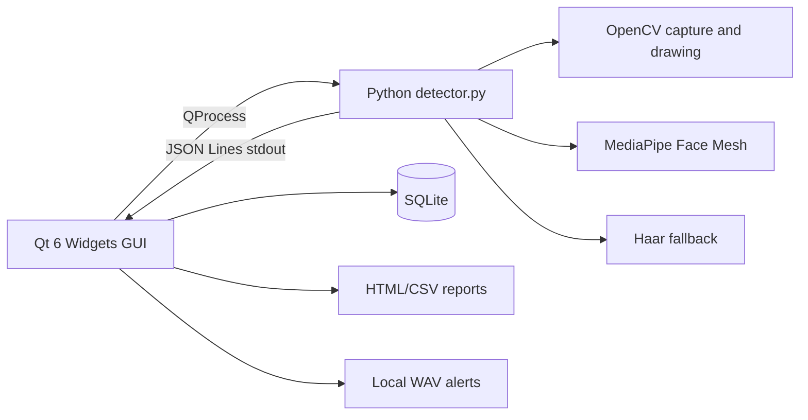

# DriveGuard-AI

DriveGuard-AI 疲劳驾驶智能预警虚拟仿真系统是一个基于 Qt 6、OpenCV 和 MediaPipe 的综合课程设计与软件工程原型。

项目默认采用 CPU 推理，不要求 NVIDIA 独立显卡。实际性能取决于 CPU、摄像头分辨率、光照和 Python 环境。本项目不是量产车载安全系统，不代表交通安全认证、医学诊断或车规结论。

## Features

- Qt 6 Widgets 桌面界面，包含实时监测、事件中心、报告中心、设备健康、个体校准和历史记录。
- Python/OpenCV/MediaPipe 检测进程，通过 QProcess 和 JSON Lines 与 Qt 通信。
- 支持虚拟场景仿真、摄像头和视频文件三种输入模式。
- 使用 EAR、MAR、短窗 PERCLOS、眨眼、哈欠、连续闭眼和姿态特征进行规则融合。
- SQLite 本地保存检测记录和安全事件。
- HTML 报告导出使用自包含图片，CSV 使用 UTF-8。
- 本地 WAV 语音提醒，不依赖云服务。
- Python 单元测试、冒烟测试和仓库检查脚本。

## Architecture



## Modes

- `simulation`: deterministic virtual scenario, default about 30 seconds per cycle and covering normal, light, moderate, and severe fatigue cues.
- `camera`: local camera input with MediaPipe as the preferred backend.
- `video`: local video file input for repeatable demonstrations.

## Quick Start

```powershell
python -m venv .venv
.\.venv\Scripts\python.exe -m pip install --upgrade pip
.\.venv\Scripts\python.exe -m pip install -r scripts\requirements.txt
python scripts\smoke_test.py
```

Build with Qt 6:

```powershell
powershell -ExecutionPolicy Bypass -File scripts\build_windows.ps1 `
  -QtRoot "C:\Qt\6.x.x\mingw_64"
```

Run from the build tree:

```powershell
.\build\bin\DriveGuardAI.exe
```

Environment variables:

- `DRIVEGUARD_ROOT`: project root override.
- `DRIVEGUARD_RUNTIME_DIR`: runtime data directory override.
- `DRIVEGUARD_PYTHON`: Python executable override.

## Detector CLI

```powershell
python scripts\detector.py --mode simulation --runtime runtime --max-samples 10 --seed 20260723
python scripts\detector.py --mode camera --runtime runtime --frame-width 800 --frame-height 450
python scripts\detector.py --mode video --source sample.mp4 --runtime runtime
```

## Tests

```powershell
python -m py_compile scripts\detector.py scripts\smoke_test.py scripts\repo_check.py tests\test_detector_logic.py
python -m unittest discover -s tests -v
python scripts\smoke_test.py
python scripts\repo_check.py
```

## Data And Privacy

The application runs locally. Runtime data is written under `runtime/` or the directory configured by `DRIVEGUARD_RUNTIME_DIR`. This may include SQLite databases, latest frames, screenshots, CSV files, and HTML reports. Do not commit real face images or runtime databases to GitHub.

## Packaging

After a successful Qt build:

```powershell
powershell -ExecutionPolicy Bypass -File scripts\package_windows.ps1
powershell -ExecutionPolicy Bypass -File verify_release.ps1 -Root dist\DriveGuard-AI-1.0.0
```

The package script excludes runtime user data and includes the executable, Qt runtime files, Python scripts, assets, documentation, license, and SHA-256 manifest.

## License

DriveGuard-AI is released under GPL-3.0-only. See `LICENSE` and `THIRD_PARTY_NOTICES.md`.

## Defense Positioning

Recommended wording: this is a Qt/OpenCV/MediaPipe course design with an enterprise delivery style. It demonstrates a complete local software loop: perception, feature extraction, rule fusion, event storage, report export, and explainable alerts. It does not claim production vehicle safety capability or measured real-world accuracy.
